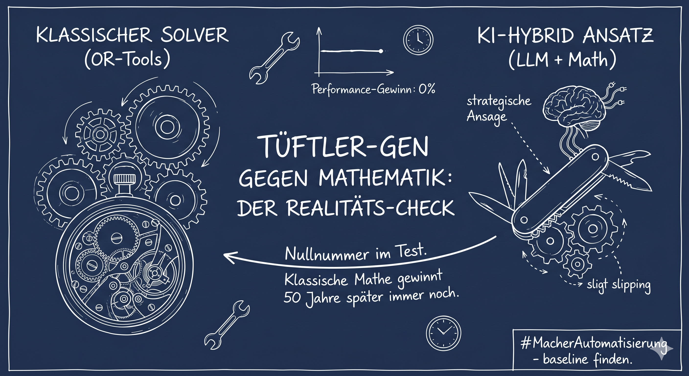
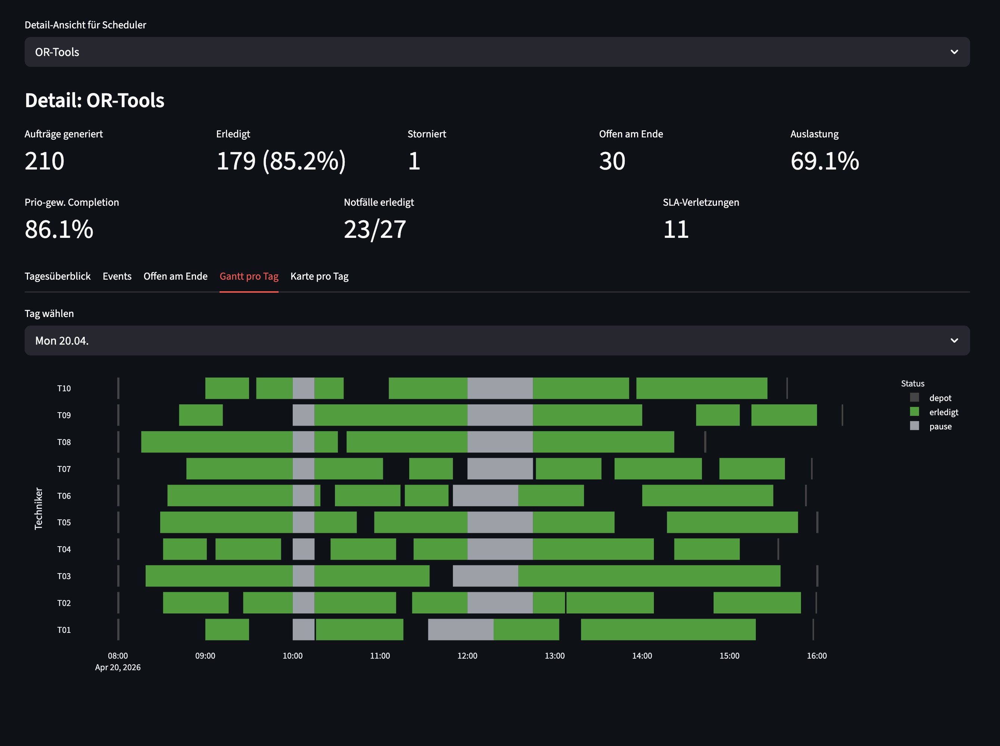
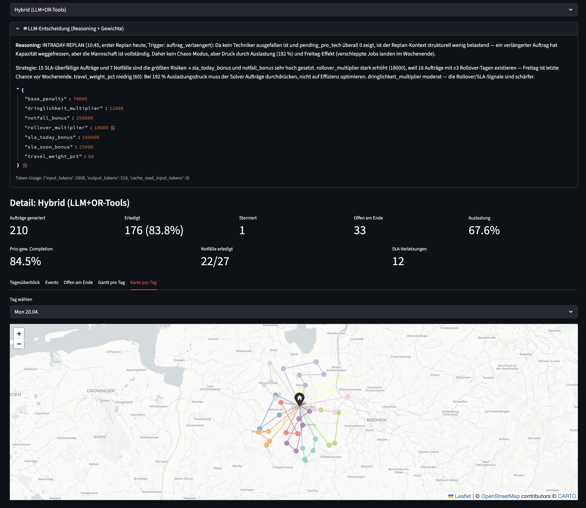
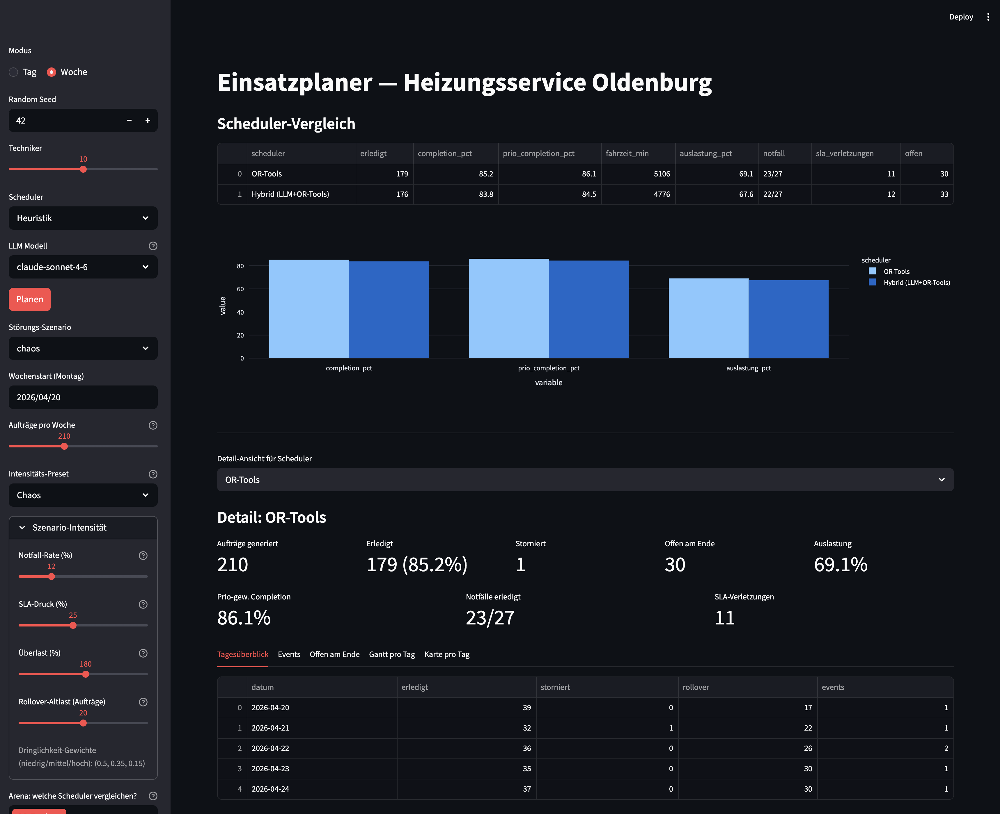

# Einsatzplaner — KI vs. klassischer Algorithmus in der Tourenplanung



Ein Experiment zur Frage: **Kann ein LLM-gestützter Scheduler einen klassischen VRPTW-Solver übertreffen — und wenn ja, wo?**

Antwort der Arbeit, in zwei Sätzen: _In niedrigdimensionalen, geografisch dominierten Tourenplanungs-Problemen ist ein vernünftig konstruierter OR-Tools-Solver dem LLM-gestützten Hybrid ebenbürtig oder marginal überlegen. Erst wenn eine zweite harte Zuordnungs-Dimension hinzukommt — z. B. Skill-Matching wie der Kälteschein für Wärmepumpen — zeigt sich ein erster, konsistent gerichteter Hybrid-Vorteil. In einer Domäne mit etabliertem algorithmischem Fundament ist LLM-Augmentation begründungspflichtig — aber die Grenze verschiebt sich mit der Problem-Dimensionalität._

## 📄 Auswertungen

Die zentralen Dokumente dieser Arbeit:

- 📊 **[Wissenschaftlicher Auswertungs-Report](docs/auswertung.md)** — Ausgangslage, Methodik, Verfahren, LLM-Prompts (wörtlich), alle drei Haupt-Ergebnisse (Multi-Profil, Replan, Replan+Context), Diskussion, Limitationen, Ausblick.
- 🔧 **[Technische Dokumentation](docs/technik.md)** — Projektstruktur, Datenmodell, Scheduler-Architektur, Replan-Infrastruktur, Benchmark-Workflow, Kennzahlen.

## Inhalt

- [Domain](#domain)
- [Vier Verfahren](#vier-verfahren)
- [Kern-Ergebnisse](#kern-ergebnisse)
- [Installation](#installation)
- [App starten](#app-starten)
- [Benchmark ausführen](#benchmark-ausführen)
- [Projektstruktur](#projektstruktur)
- [Lizenz](#lizenz)

## Domain

Fiktiver Heizungsbaubetrieb in Oldenburg (Oldb.) mit **10 Servicetechnikern**, die täglich 40–50 Wartungsaufträge im 30-km-Radius erledigen. Zu lösen: VRPTW (Vehicle Routing Problem with Time Windows) mit Priorisierung (Dringlichkeit, Notfälle, SLA-Fristen, Rollover-Count), Pausenpflicht (15 min Frühstück, 45 min Mittag), Zeitfenstern für Gewerbe- und Fixtermine und **stochastischen Intraday-Störungen** (Krankmeldung, Stau, Auftragsverlängerung, spontaner Notfall, Kundenabsage).

## Vier Verfahren

| Verfahren | Ansatz | Stärke | Schwäche |
|---|---|---|---|
| **Heuristik** | Deterministische Greedy-Insertion mit Prio-Score | Sekundenschnell, keine Abhängigkeiten | Keine globale Optimierung, ~14 pp Completion unter den Solvern |
| **OR-Tools VRPTW** | Google OR-Tools mit Disjunction-Penalties, per-Vehicle Start-Nodes für Replan | Globale Optimierung, robust gegen Penalty-Variation | Deterministisch kalibriert, reagiert nicht auf Tageskontext |
| **LLM-Direct** | Claude Sonnet 4.6 macht Zuordnung + Reihenfolge via Tool-Use | Erklärt seine Strategie in natürlicher Sprache | Kombinatorisch schwächer, unterfüllt die Touren |
| **Hybrid** | LLM setzt pro Tag/Replan die Penalty-Gewichte, OR-Tools optimiert | Kontext-sensitive Kalibrierung ohne manuelle Regel | Kein messbarer Performance-Gewinn gegenüber statischer Kalibrierung |

## Kern-Ergebnisse

Vier unabhängige Haupttests in einer Progression — drei negative, ein richtungsweisend positiver Befund:

| Test | Setup | Ergebnis |
|---|---|---|
| **Multi-Profil-Woche** | 20 Seeds, 5 Tagesprofile Mo–Fr + stochastische Intraday-Events; vier statische Kalibrierungen + Hybrid | Alle fünf Varianten **statistisch ununterscheidbar**. Hybrid liefert **keinen Performance-Vorteil**. |
| **Replan-Test** | 10 Seeds, Intraday-Events triggern Scheduler-Replan | Replan hilft nur der Heuristik (+2.9 pp). Hybrid und OR-Tools verlieren beide leicht durch kleinteilige Replan-Zyklen. |
| **Replan + Tagesverlauf-Kontext** | 10 Seeds, Hybrid bekommt Tagesverlaufs-Info (wievielter Replan, Trigger-Event, Rest-Schicht pro Tech) | **Kein Mittelwert-Gewinn** gegenüber „Replan ohne Kontext". Einziger Effekt: Streuung sinkt (±2.43 → ±1.73). |
| **Qualifikations-Constraint** | 10 Seeds, 40 % Techniker mit Kälteschein, 20 % Aufträge erfordern ihn | **Erstes positives Signal**: Hybrid nominell +0.13 pp vor OR-Tools-normal, und verliert am wenigsten durch das Constraint (−0.01 pp vs. −0.18 bis −0.55 bei statischen Varianten). Statistisch noch nicht signifikant (n=10), aber konsistent gerichtet. |

Details, Tabellen und Interpretation in der [wissenschaftlichen Auswertung](docs/auswertung.md).

## Installation

```bash
git clone git@github.com:straussbastian/Einsatzplanerauswertung.git
cd Einsatzplanerauswertung
python3 -m venv .venv
source .venv/bin/activate
pip install -r requirements.txt
cp .env.example .env
# .env öffnen und ANTHROPIC_API_KEY eintragen (nur für LLM/Hybrid nötig)
```

## App starten

Die interaktive Streamlit-Oberfläche läuft mit:

```bash
streamlit run app.py
```

Features:
- **Tag-Modus**: Plane einen einzelnen Tag mit frei gewähltem Scheduler, Gantt-Chart, Karte, Techniker-Übersicht.
- **Wochen-Modus**: Fünf-Tage-Lauf mit Szenario-Auswahl, Intensitäts-Presets (Normal / Hochlast / Notfallwoche / SLA-Katastrophe / Chaos / Realistisch), Pro-Woche-Auftragsmenge. Zeigt Tagesüberblick, Events, Gantt pro Tag, Karte pro Tag, bei Hybrid das LLM-Reasoning + die gewählten Gewichte.
- **Arena**: Mehrere Scheduler parallel auf denselben Daten vergleichen, automatische Metrik-Tabelle und Balkendiagramme.

### Gantt-Chart pro Tag

Zeigt jeden Techniker als eigene Zeile, farblich unterschieden nach Stop-Typ (geplant / erledigt / storniert / nicht ausgeführt / Pause / Depot). Pausen werden realistisch mitten im Auftrag dargestellt, wenn die Arbeit über die Mittagszeit läuft.



### Karte pro Tag

Folium-Karte mit Betriebshof und den Touren je Techniker, farblich getrennt. Klick auf einen Stop zeigt Auftrags-ID, Kunde, Adresse und Status.



### Arena: mehrere Scheduler direkt vergleichen

Multi-Select in der Sidebar wählt die Scheduler aus, die auf denselben generierten Daten laufen. Ergebnis ist eine Metrik-Tabelle plus Balkendiagramm-Vergleich über Completion, Prio-gewichtete Completion und Auslastung. Bei Hybrid werden zusätzlich Reasoning + gewählte Penalty-Gewichte angezeigt.



## Benchmark ausführen

Der Multi-Seed-Benchmark reproduziert die Ergebnisse aus dem Auswertungsreport:

```bash
# Voller Lauf (alle 5 Scheduler × 20 Seeds, ~60 Min mit Hybrid)
python bench/multiseed_benchmark.py --seeds 20 --llm-model claude-sonnet-4-6

# Schneller Preview (4 Scheduler × 10 Seeds, ~25 Min)
python bench/multiseed_benchmark.py --seeds 10 --core-only

# Ohne LLM (spart API-Kosten, nur Heuristik + OR-Tools-Varianten)
python bench/multiseed_benchmark.py --seeds 20 --skip-hybrid
```

Rohdaten landen als CSV in `bench/results_*.csv`, aggregierte Kennzahlen in `bench/results_*_aggregated.csv`.

## Projektstruktur

```
Einsatzplanerauswertung/
├── README.md                       # diese Datei
├── .env.example                    # Template für API-Key
├── requirements.txt
├── app.py                          # Streamlit-UI (Tag- + Wochen-Modus + Arena)
├── einsatzplaner/
│   ├── models.py                   # Dataclasses: Auftrag, Techniker, Stop, Tour, …
│   ├── generator.py                # Auftragsgenerator, Szenarioprofile, Multi-Profil-Woche
│   ├── geo.py                      # Haversine + austauschbares RouteProvider-Interface
│   ├── simulator.py                # Wochenlauf, Intraday-Event-Würfler, Replan-Trigger
│   ├── disruptions.py              # YAML-Szenario-Loader
│   ├── evaluator.py                # Metriken + Vergleichs-DataFrames
│   ├── visualization.py            # Gantt-Transformer: Pausen mitten im Auftrag
│   └── scheduler/
│       ├── base.py                 # Scheduler-Protocol, PlanInput, TechSnapshot, ReplanKontext
│       ├── heuristic.py            # Greedy-Insertion (mit Replan-Support)
│       ├── ortools_vrp.py          # OR-Tools VRPTW (mit Replan + per-Vehicle Start-Nodes)
│       ├── llm.py                  # LLM-Direct (Claude als Disponent)
│       └── hybrid.py               # LLM wählt Penalty-Gewichte, OR-Tools löst
├── scenarios/                      # YAML-Störungsszenarien (Krank, Absagen, Stau, Chaos)
├── bench/
│   └── multiseed_benchmark.py      # CLI-Benchmark für Reports
├── docs/
│   ├── auswertung.md               # Wissenschaftlicher Haupt-Report
│   └── technik.md                  # Technische Dokumentation
└── assets/
    └── title.png                   # Titelbild
```

## Tech-Stack

- **Python 3.14**
- **Streamlit** für die UI
- **Google OR-Tools** (`ortools`) für den VRPTW-Solver
- **Anthropic Claude** (Sonnet 4.6 / Opus 4.6 / Haiku 4.5 wählbar) für LLM- und Hybrid-Scheduler
- **Plotly / Folium** für Gantt-Charts und Karten
- **pytest** für Tests (Infrastruktur vorbereitet, Tests aktuell Minimal)

## Status

Prototyp / Forschungsprojekt. Die Ergebnisse sind reproduzierbar, aber **nicht im Feld validiert**. Siehe [Limitationen in der Auswertung](docs/auswertung.md#8-limitationen).

## Lizenz

MIT — siehe LICENSE.
